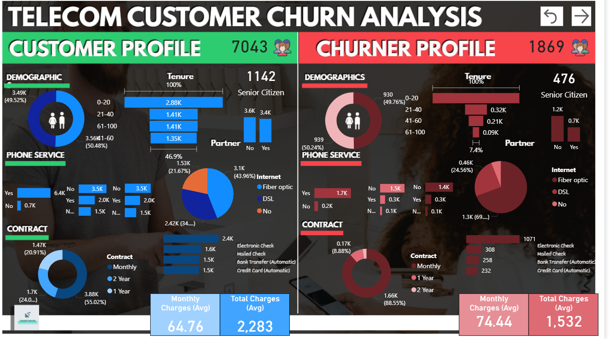
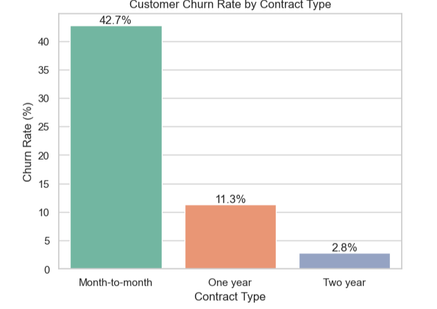
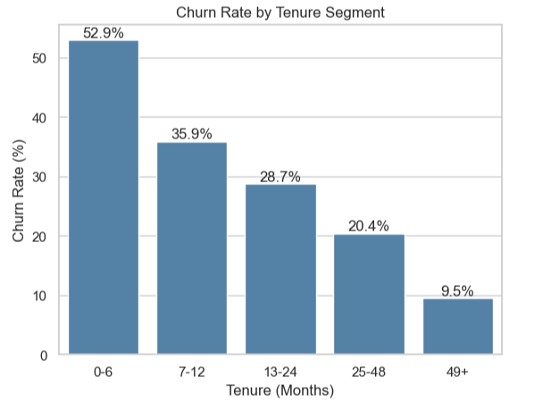
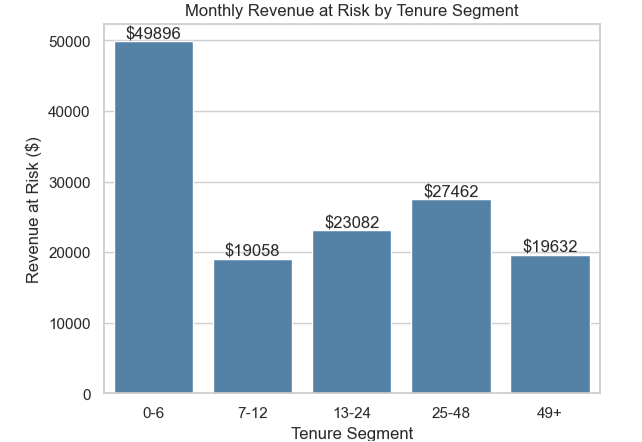
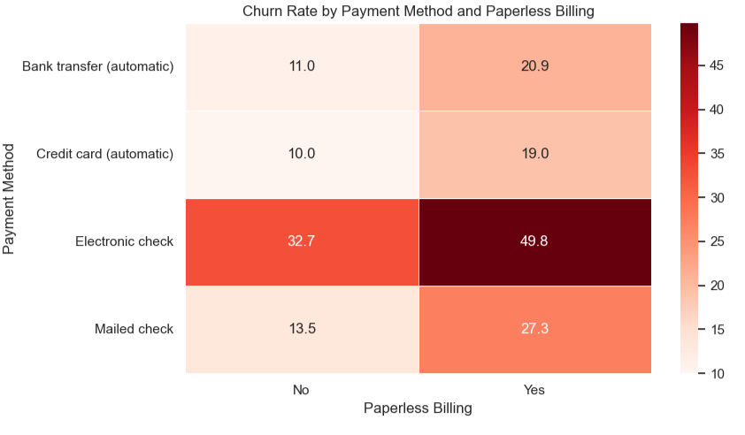

# 📊 Telecom Customer Churn Analysis

## 📌 Project Overview

This project analyzes customer churn using the IBM Telecom Customer Churn dataset to identify key factors influencing customer attrition and recommend data-driven retention strategies.

The analysis focuses on answering business questions such as:

- Which customers are most likely to churn?
- Which customer segments contribute the highest revenue loss?
- How do contract type, tenure, service adoption, and billing behavior affect churn?
- Which customer segments should be prioritized for retention campaigns?

The project combines Python-based Exploratory Data Analysis (EDA) with a Power BI dashboard to transform raw customer data into actionable business insights.

---

## 🛠️ Tools & Technologies

- Python
- Pandas
- NumPy
- Matplotlib
- Seaborn
- Power BI
- Jupyter Notebook

---

## 📂 Project Structure

```text
Telecom Customer Churn/
│
├── Telecom_Customer_Churn.csv
├── Telecom_churn_analsysis.ipynb
│
└── Images/
    ├── contract_churn_rate.png
    ├── tenure_churn_rate.png
    ├── revenue_risk_internet_service.png
    ├── churn_risk_heatmap.png
    └── Power_Bi_dashboard.png
```

---

# 📈 Power BI Dashboard

The interactive Power BI dashboard summarizes the most important churn KPIs and customer risk segments.



---

# 📊 Key Visualizations

## Customer Churn Rate by Contract Type

Identifies contract types with the highest customer churn.



---

## Churn Rate by Tenure Segment

Highlights how churn changes throughout the customer lifecycle.



---

## Monthly Revenue at Risk by Internet Service

Shows which internet service categories contribute the highest monthly revenue loss due to customer churn.



---

## Customer Churn Risk Matrix

Combines customer tenure and monthly charges to identify high-risk customer segments requiring immediate retention efforts.



---

# 💡 Key Business Insights

- Month-to-month customers and customers within their first six months show the highest churn rates, making them the primary retention target.
- Customer churn results in approximately **$139K** in monthly recurring revenue loss, with Fiber Optic customers contributing the largest share.
- Customers without Online Security or Tech Support exhibit significantly higher churn than customers using both services.
- Customers with higher monthly charges are more likely to churn, particularly during the early stages of their subscription.
- The combination of short customer tenure and high monthly charges represents the highest-risk customer segment and should be prioritized for targeted retention campaigns.

---

## 🚀 Future Improvements

- Build machine learning models to predict customer churn.
- Perform customer segmentation using clustering techniques.
- Develop interactive retention strategy dashboards.
- Deploy the churn prediction model as a web application.

---

## 📄 Dataset

IBM Telco Customer Churn Dataset
